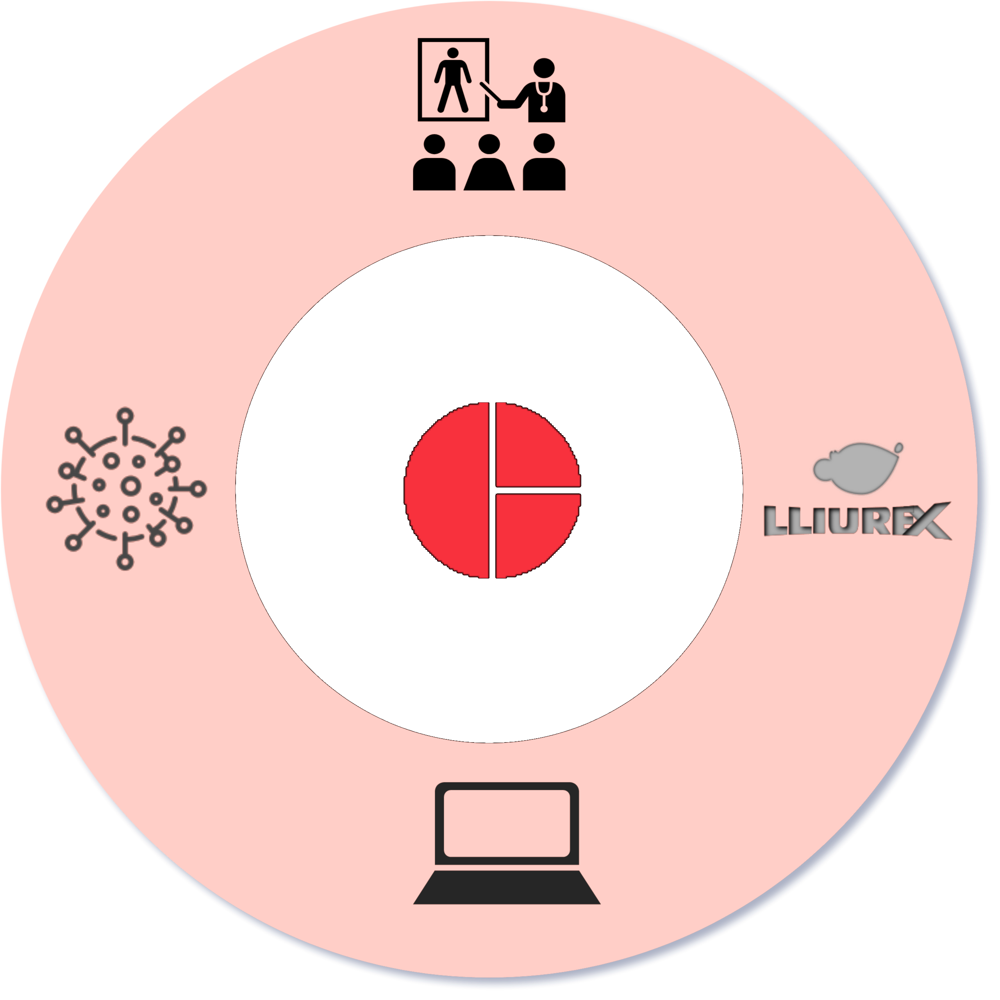
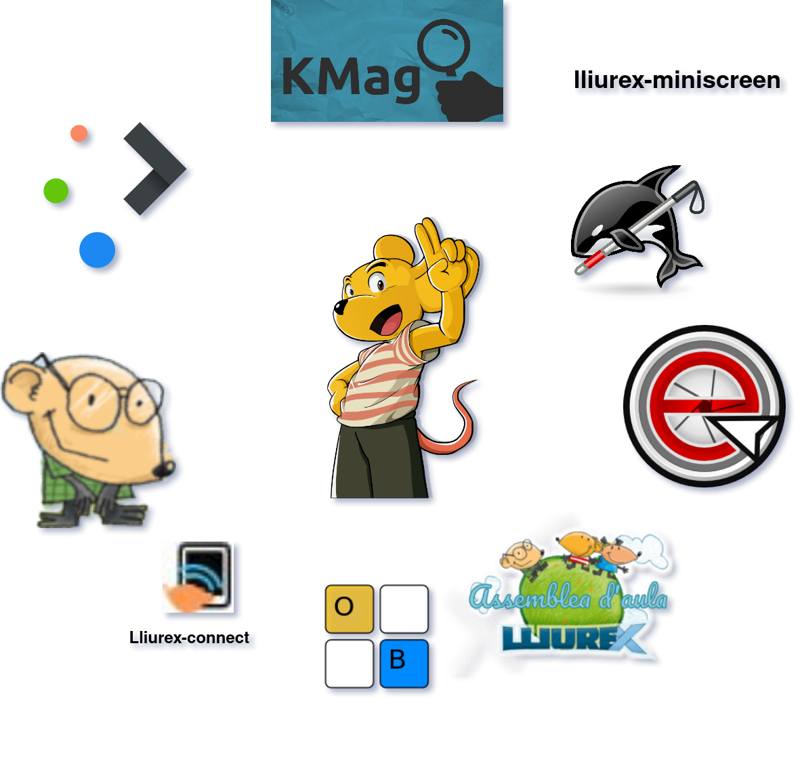
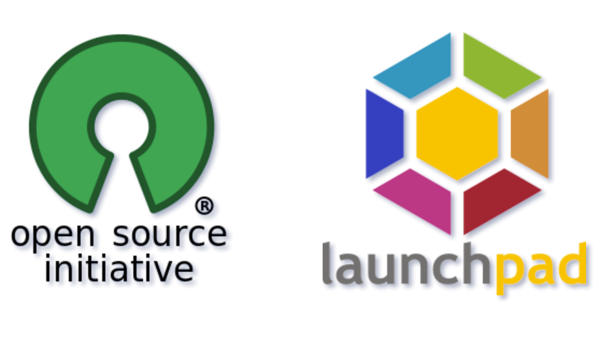
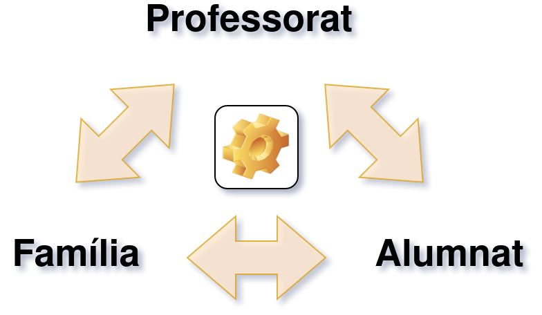

# Context

---

### DE què partim?

{ style="height: 600px; padding: 10px;" }

---

### Situació ideal

# Proposta

---

### Adeqüació

> Actualització de les competències digitals per a l'elaboració d'estratègies en inclusió educativa

* Objectius realistes i veritablement útils
* Adaptació a excepcionalitats

---

### Acompanyament i assessorament

{ style="height: 600px; padding: 10px;" }

---

### Utilització d'eines corporatives

{ style="height: 580px; padding: 10px;" }

---

### La comunitat i recursos

<!-- :::: {style="display: flex;"}

::: {}

:::

::: {}

:::

:::: -->

# Repercusió

---

### Comunitat educativa

### Sobirania tecnològica

{ style="height: 400px;" }

### Bibliografia i recursos

* [Diagrams](https://app.diagrams.net/)
* [Pixabay](https://pixabay.com/es/)
* [PPA llx4nee](https://launchpad.net/~joamuran/+archive/ubuntu/llx4nee)
* [Sobirania tecnológica vol 2](https://www.ritimo.org/IMG/pdf/sobtech2-es-with-covers-web-150dpi-2018-01-13-v2.pdf)
* Gimp
* Pandoc
* Taiga i Nextcloud

# Moltes gràcies